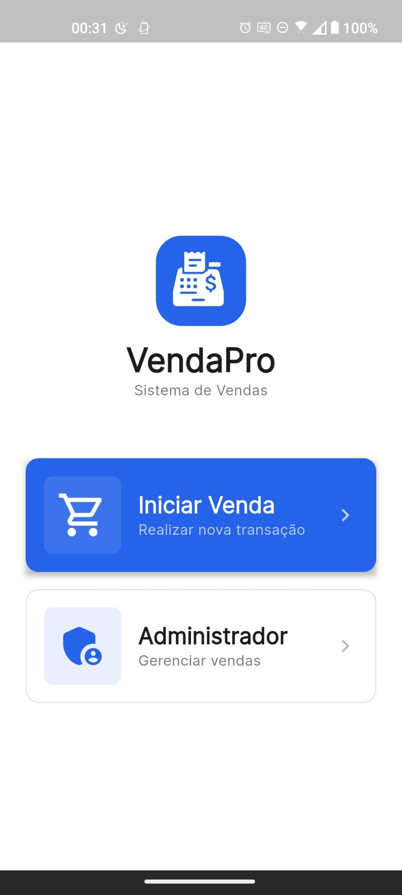

# 🏪 VendaPro - Sistema de Ponto de Venda

<div align="center">


[](https://flutter.dev/)
[](LICENSE)
[](https://pub.dev/packages/flutter_lints)

</div>

## 📱 Visão Geral

O VendaPro é uma aplicação moderna de Ponto de Venda (POS) desenvolvida com Flutter, projetada para oferecer uma experiência fluida e intuitiva para comerciantes. Com uma interface elegante e recursos poderosos, o VendaPro simplifica o processo de vendas e gestão do seu negócio.

## 🚀 Funcionalidades

- 🛍️ **Gestão de Vendas**
  - Tela de seleção do vendedor
  - Tela de seleção dos produtos 
  - Tela de resumo com as opções de pagamento(somente pagamento em dinheiro implementado)
  - Tela de pagamento em dinheiro

- 📊 **Gestão administrativa**
  - Tela de login
  - Tela com as opções administrativas(somente cancelamento de vendas implementado)
  - Tela de cancelamento de vendas

## 🧑‍💻 Tecnologias Utilizadas

- **Flutter** - Framework UI
- **Bloc** - Gerenciamento de Estado
- **GetIt** - Injeção de Dependências
- **Dio** - Cliente HTTP
- **Flutter Secure Storage** - Armazenamento Seguro
- **Google Fonts** - Tipografia
- **Flutter Screenutil** - Responsividade

## ⚙️ Como Rodar o Projeto

### Pré-requisitos

- Flutter SDK 3.7+
- Dart SDK ^3.7.2
- Git

### Passo a Passo

1. Clone o repositório
```bash
git clone https://github.com/seu-usuario/vendapro.git
cd vendapro
```

2. Instale as dependências
```bash
flutter pub get
```

3. Execute o projeto
```bash
flutter run
```

## 📸 Capturas de Tela

##### - Fluxo de vendas
<div align="center">

|||
|--|--|--|
||||
</div>


##### - Fluxo Administrativo

<div align="center">

|||
|--|--|--|

</div>


## 📦 Estrutura de Pastas

```
lib/
├── core/               # Configurações e utilitários core
├── features/           # funcionalidades e recursos
│   ├── data/           # Camada de dados e repositórios
│   ├── domain/         # Regras de negócio e entidades
│   ├── presentation/   # Widgets e telas
│   └── Services/       # Lógicas de negócio e gerenciamento de estado
├── shared/            # Widgets ou outros componentes reutilizáveis
└── main.dart      # Ponto de entrada da aplicação
```

## 📄 Licença

Este projeto está licenciado sob a Licença MIT - veja o arquivo [LICENSE](LICENSE) para detalhes.

---

<div align="center">

Desenvolvido com ❤️ por Francis.

</div>
